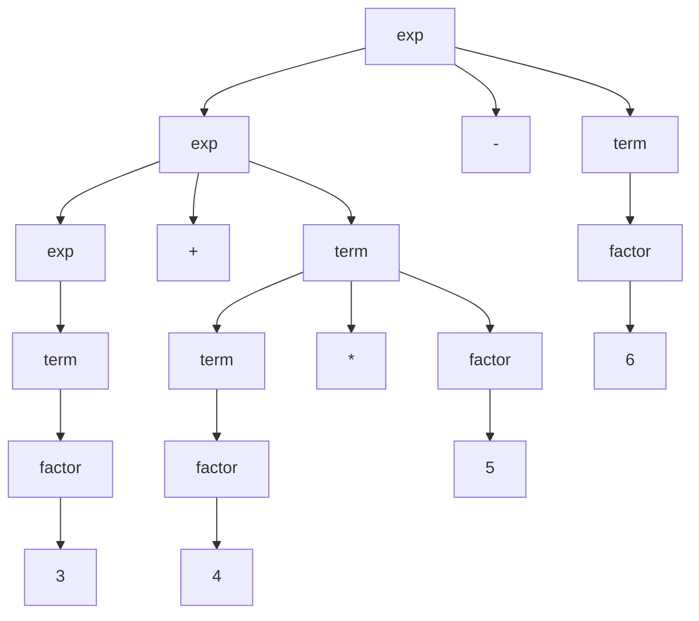
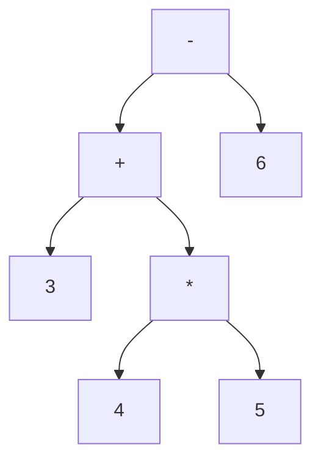
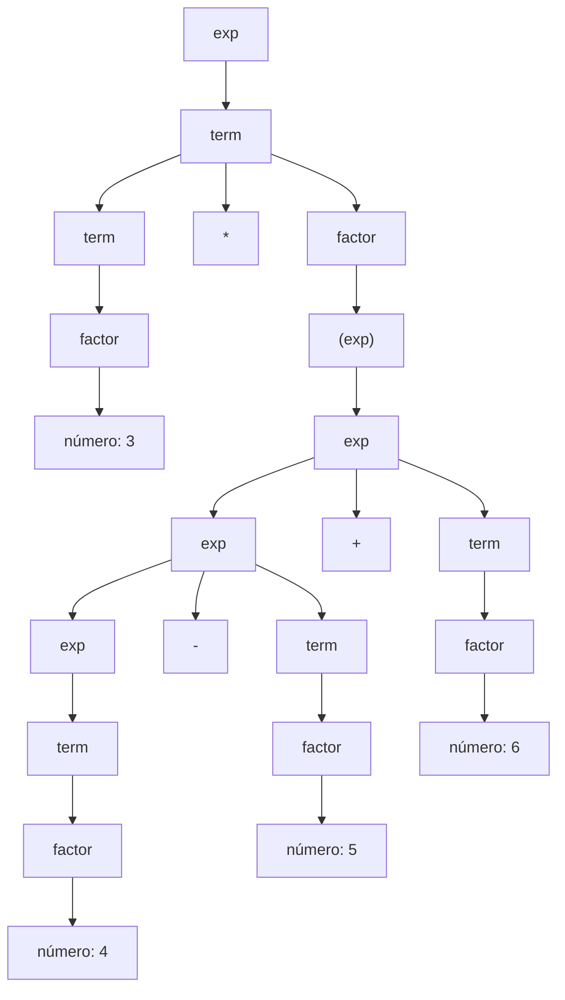
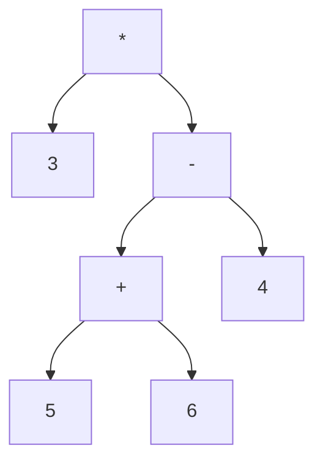
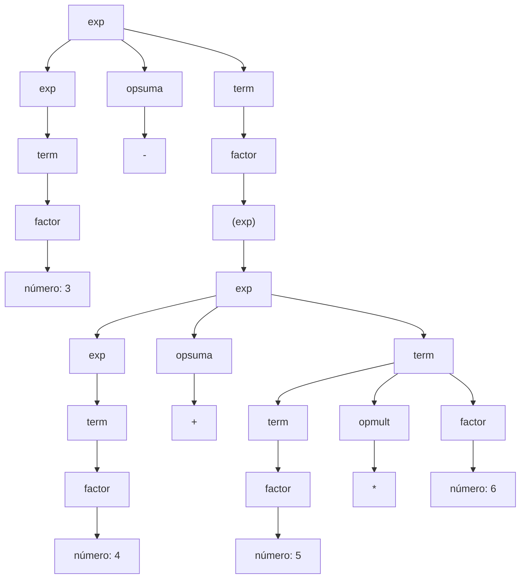
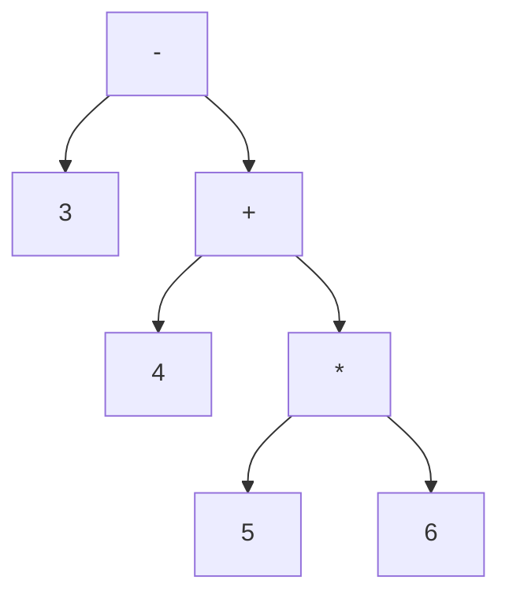

## INSTITUTO TECNOLÓGICO Y DE ESTUDIOS SUPERIORES DE MONTERREY

**Campus Santa Fe**

# Tarea 2: Gramáticas

### Desarrollo de aplicaciones avanzadas de ciencias computacionales

**Group 501**

Student
Ricardo Alfredo Calvo Pérez - A01028889

Professor
Victor Manuel de la Cueva Hernández

_April 2026_

### 2.1

a. Escriba una gramática no ambigua que genere el conjunto de cadenas

$${ s;,\space s;s;,\space s;s;s;,\space s;s;s;s;, \dots}$$

$$S \rightarrow s;|s;  S$$

b. Dé una derivación por la izquierda y por la derecha para la cadena `s;s;` utilizando su gramática.

Derivada por al izquierda

$$
\begin{array}{lcl}
S \Rightarrow s;S \\
s;S \Rightarrow s;s; \\
\end{array}
$$

Derivada por al derecha

$$
\begin{array}{lcl}
S \Rightarrow s;S \\
s;S \Rightarrow s;s; \\
\end{array}
$$

---

### 2.2

Dada la gramática:

$$A \rightarrow AA \mid (A) \mid \varepsilon$$

1. Describa el lenguaje que genera.

Esta gramática nos da como resultado una cadena que puede resultar desde vacío $\epsilon$ hasta una cadena de paréntesis ordenados. Estos paréntesis pueden ir unos dentro de otros e incluso unos a lados de otros, pero siempre ordenados con su paréntesis que abre y su paréntesis que cierra.

1. Muestre que es ambigua.

$$
\begin{array}{lcl}
A \Rightarrow AA \\
AA \Rightarrow (A)A \\
(A)A \Rightarrow ()A \\
()A \Rightarrow ()(A) \\
()(A) \Rightarrow ()() \\
\end{array}
$$

$$
\begin{array}{lcl}
A \Rightarrow AA \\
AA \Rightarrow A(A) \\
A(A) \Rightarrow A() \\
A() \Rightarrow (A)() \\
(A)() \Rightarrow ()() \\
\end{array}
$$

---

### 2.3

Dada la gramática:

$$
\begin{array}{lcl}
exp &\rightarrow& exp\; opsuma\; term \mid term \\
opsuma &\rightarrow& + \mid - \\
term &\rightarrow& term\; opmult\; factor \mid factor \\
opmult &\rightarrow& * \\
factor &\rightarrow& (exp) \mid \text{número}
\end{array}
$$

Escriba derivaciones por la izquierda, árboles de análisis gramatical y árboles sintácticos abstractos para las siguientes expresiones:

1. `3 + 4 * 5 - 6`

#### Derivaciones por la izquierda

$$
\begin{array}{lcl}
exp &\Rightarrow& exp\; opsuma\; term \\
    &\Rightarrow& exp\; opsuma\; term\; opsuma\; term \\
    &\Rightarrow& term\; opsuma\; term\; opsuma\; term \\
    &\Rightarrow& factor\; opsuma\; term\; opsuma\; term \\
    &\Rightarrow& \text{número}\; opsuma\; term\; opsuma\; term \\
    &\Rightarrow& 3\; opsuma\; term\; opsuma\; term \\
    &\Rightarrow& 3\; +\; term\; opsuma\; term \\
    &\Rightarrow& 3\; +\; term\; opmult\; factor\; opsuma\; term \\
    &\Rightarrow& 3\; +\; factor\; opmult\; factor\; opsuma\; term \\
    &\Rightarrow& 3\; +\; \text{número}\; opmult\; factor\; opsuma\; term \\
    &\Rightarrow& 3\; +\; 4\; opmult\; factor\; opsuma\; term \\
    &\Rightarrow& 3\; +\; 4\; * factor\; opsuma\; term \\
    &\Rightarrow& 3\; +\; 4\; * \text{número}\; opsuma\; term \\
    &\Rightarrow& 3\; +\; 4\; * 5\; opsuma\; term \\
    &\Rightarrow& 3\; +\; 4\; * 5\; -\; term \\
    &\Rightarrow& 3\; +\; 4\; * 5\; -\; factor \\
    &\Rightarrow& 3\; +\; 4\; * 5\; -\; \text{número} \\
    &\Rightarrow& 3\; +\; 4\; * 5\; -\; 6 \\
\end{array}
$$

#### Árboles de análisis gramatical

#### Árboles sintácticos abstractos

2. `3 * (4 - 5 + 6)`

#### Derivaciones por la izquierda

$$
\begin{array}{lcl}
exp &\Rightarrow& term \\
    &\Rightarrow& term\; opmult\; factor\; \\
    &\Rightarrow& factor\; opmult\; factor\; \\
    &\Rightarrow& \text{número}\; opmult\; factor\; \\
    &\Rightarrow& 3\; opmult\; factor\; \\
    &\Rightarrow& 3\; * factor\; \\
    &\Rightarrow& 3\; * (exp)\; \\
    &\Rightarrow& 3\; * (exp\; opsuma\; term)\; \\
    &\Rightarrow& 3\; * (exp\; opsuma\; term\; opsuma\; term)\; \\
    &\Rightarrow& 3\; * (term\; opsuma\; term\; opsuma\; term)\; \\
    &\Rightarrow& 3\; * (factor\; opsuma\; term\; opsuma\; term)\; \\
    &\Rightarrow& 3\; * (\text{número}\; opsuma\; term\; opsuma\; term)\; \\
    &\Rightarrow& 3\; * (4\; opsuma\; term\; opsuma\; term)\; \\
    &\Rightarrow& 3\; * (4\; -\; term\; opsuma\; term)\; \\
    &\Rightarrow& 3\; * (4\; -\; factor\; opsuma\; term)\; \\
    &\Rightarrow& 3\; * (4\; -\; \text{número}\; opsuma\; term)\; \\
    &\Rightarrow& 3\; * (4\; -\; 5\; opsuma\; term)\; \\
    &\Rightarrow& 3\; * (4\; -\; 5\; +\; term)\; \\
    &\Rightarrow& 3\; * (4\; -\; 5\; +\; factor)\; \\
    &\Rightarrow& 3\; * (4\; -\; 5\; +\; \text{número})\; \\
    &\Rightarrow& 3\; * (4\; -\; 5\; +\; 6)\; \\
\end{array}
$$

#### Árboles de análisis gramatical

#### Árboles sintácticos abstractos

3. `3 - (4 + 5 * 6)`

#### Derivaciones por la izquierda

$$
\begin{array}{lcl}
exp &\Rightarrow& exp\; opsuma\; term \\
    &\Rightarrow& term\; opsuma\; term\\
    &\Rightarrow& factor\; opsuma\; term\\
    &\Rightarrow& \text{número}\; opsuma\; term\\
    &\Rightarrow& 3\; opsuma\; term\\
    &\Rightarrow& 3\; -\; term\\
    &\Rightarrow& 3\; -\; factor\\
    &\Rightarrow& 3\; -\; (exp)\\
    &\Rightarrow& 3\; -\; (exp\; opsuma\; term)\\
    &\Rightarrow& 3\; -\; (term\; opsuma\; term)\\
    &\Rightarrow& 3\; -\; (factor\; opsuma\; term)\\
    &\Rightarrow& 3\; -\; (\text{número}\; opsuma\; term)\\
    &\Rightarrow& 3\; -\; (4\; opsuma\; term)\\
    &\Rightarrow& 3\; -\; (4\; +\; term)\\
    &\Rightarrow& 3\; -\; (4\; +\; term\; opmult\; factor)\\
    &\Rightarrow& 3\; -\; (4\; +\; factor\; opmult\; factor)\\
    &\Rightarrow& 3\; -\; (4\; +\; \text{número}\; opmult\; factor)\\
    &\Rightarrow& 3\; -\; (4\; +\; 5\; opmult\; factor)\\
    &\Rightarrow& 3\; -\; (4\; +\; 5\; * factor)\\
    &\Rightarrow& 3\; -\; (4\; +\; 5\; * \text{número})\\
    &\Rightarrow& 3\; -\; (4\; +\; 5\; * 6)\\
\end{array}
$$

#### Árboles de análisis gramatical

#### Árboles sintácticos abstractos

---

### 2.4

La gramática siguiente genera todas las expresiones regulares sobre el alfabeto de letras
(utilizamos comillas para encerrar operadores, puesto que la barra vertical también es un operador además de un metasímbolo):

$$
\begin{array}{lcl}
rexp &\rightarrow& rexp\; "\mid"\; rexp \\
 &\mid& rexp\; rexp \\
 &\mid& rexp\; "*" \\
 &\mid& "("\; rexp\; ")" \\
 &\mid& letra
\end{array}
$$

1. Proporcione una derivación para la expresión regular `(a|b)*` utilizando esta gramática.

$$
   \begin{array}{lcl}
   rexp &\mid& rexp\ "\*" \\
   &\Rightarrow& "("\ rexp ")"* \\
   &\Rightarrow& "("\ rexp\ "\mid"\ rexp\ ")"* \\
   &\Rightarrow& "("\ letra\ "\mid"\ rexp\ ")"* \\
   &\Rightarrow& "("\ a\ "\mid"\ rexp\ ")"* \\
   &\Rightarrow& "("\ a\ "\mid"\ letra\ ")"* \\
   &\Rightarrow& "("\ a\ "\mid"\ b\ ")"* \\
   \end{array}
$$

2. Muestre que esta gramática es ambigua.

Para esta demostración vamos a usar la siguiente cadena `a|bs`

$$
   \begin{array}{lcl}
   rexp &\rightarrow& rexp\ "\mid"\ rexp \\
   rexp &\rightarrow& a\ "\mid"\ rexp \\
   rexp &\rightarrow& a\ "\mid"\ rexp\ rexp \\
   rexp &\rightarrow& a\ "\mid"\ b\ c \\
   \end{array}
$$

$$
   \begin{array}{lcl}
   rexp &\rightarrow& rexp\ rexp \\
   rexp &\rightarrow& rexp\ "\mid"\ rexp\ rexp \\
   rexp &\rightarrow& a\ "\mid"\ rexp\ rexp \\
   rexp &\rightarrow& a\ "\mid"\ b\ c \\
   \end{array}
$$

3. Vuelva a escribir esta gramática para establecer las precedencias correctas para los operadores (véase el capítulo 2).
4. ¿Qué asociatividad da su respuesta en el inciso c para los operadores binarios? Explique su respuesta.
   $$
