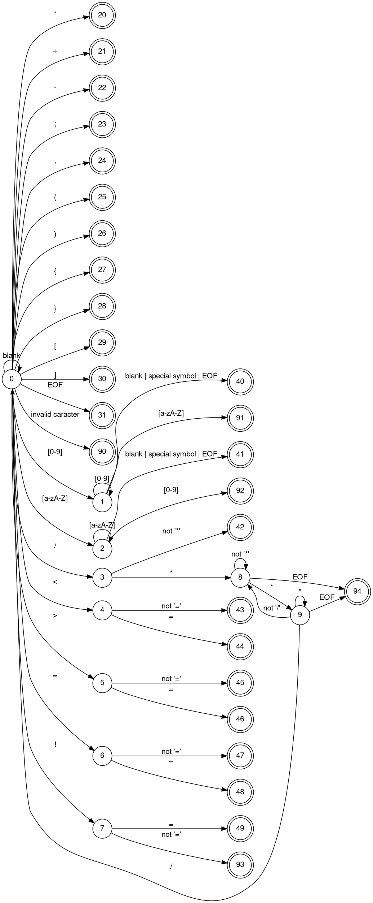

<div style="text-align: center;">
<h1>Project 1</h1>
<h2>Lexical Analyzer</h2>
<h6>Language C-</h6>
</div>

<h3>Description:</h3>

Create a program in Python, called `lexer.py` that contains a function called `getToken(print = True)`, which receives a boolean flag print, with default value True (its use is explained later) and returns the next token found in the input string or an error message.

Use the table implementation.

Generate a separate file called `globalTypes.py`, which contains all the variable types that will be handled in your project. This file must be in the same folder as the lexical analyzer so that it can be imported without problems and without needing special paths.

The file `globalTypes.py` will contain, among other things, the definition of the enumerated type:

`class TokenType(Enum)`: which will contain all the required tokens (with their values) and in particular must contain the token `ENDFILE (TokenType.ENDFILE)`, so that it can be tested without problems (see "program testing").

Of course, it can contain all the enumerated types required for the proper functioning of the lexical analyzer.

The program `lexer.py`, at the beginning, must import the file containing the types to be handled, in the following way:

```py
from globalTypes import *
```

Then, it will continue with the definition of the function getToken(print = True) and all the auxiliary functions it requires.

The function `getToken(print = True)`:

- Must declare some <u>global variables</u>, (see the section "program testing").

- Through these variables, it can handle the text file containing a program in C- that is to be analyzed.

- Each time it is invoked, it will return the next token it finds, that is, the pair (TOKEN, Lexeme), or an error, when that is the case (see "Error detection and recovery"). Its invocation will be done in the following way:

  ```py
  token, tokenString = getToken(true)
  ```

  Por lo que la función regresará los dos valores por separado, de la siguiente forma:

  ```py
  return token, tokenString
  ```

- Of course, `token` is of type `TokenType` and `tokenString` is of type **String** and corresponds to `token.val`, but by receiving it this way, it avoids having to obtain its value.

- If the print flag is true, the function must print the pair (TOKEN, lexeme) found, before returning it. One option would be to do this:

  ```py
    print(token," = ", tokenString)
  ```

<h3>Error detection and recovery:</h3>

If the lexical analyzer finds an error (remember that the lexical analyzer only finds errors in the formation of tokens, it does not say anything regarding the syntax of the language), it must mark the line and the place (character) where it found the error. For example, if line 22 of the file is:

```py
contador = contador + 3indice
```

it will detect the tokens:

<div style="text-align: center;">

**(ID, “contador”)**
**(EQUAL, “=”)**
**(ID, “contador”)**
**(PLUS, “+”)**
**(ERROR, “”)**

</div>

Sending an error message like:

Line 22: Error in the formation of an integer:

```py
contador = contador + 3indice
                      ^
```

Where the line number is indicated and the caret (^) will indicate the position of the character where the error was found.

After this, it must have a mechanism to try to recover from the error and continue with token detection. Of course, nothing guarantees the accuracy of what is detected afterwards, which will depend on the mechanism used and, above all, on the intention that the programmer had when writing the code, which we completely ignore and can only suppose.

<h3>Program testing</h3>

All the necessary files for it to run (all those delivered in Canvas and the one containing the test file) will be placed in the same folder to avoid the use of additional paths.

The lexical analyzer will be tested with a script that will start by importing both the file with the global types and the one containing your lexical analyzer. Then it will continue invoking your function to obtain a token, with the printing option activated, until the file ends, that is, until it reaches the token that indicates the end of the file.

The function `getToken(print)` must handle the following global variables:

**position**: contains the position of the next character of the string to be analyzed. It must be able to modify it in its operation.

**progLong**: contains the length of the program. It will only read it when required.

**program**: contains the string of the complete program. It will only read it when required.

Due to the way Python works when defining variables and doing imports, the only way we have to pass these global variables will be through a function that receives them and passes the received value to the global variables that your program uses.

The function for passing global values must be added to your program and will have the following form:

```py
  def globales(prog, pos, long):
    global programa
    global posicion
    global progLong
    programa = prog
    posicion = pos
    progLong = long
```

The script with which it is tested will be the following:

```py
from globalTypes import *
from lexer import *
f = open('sample.c-', 'r')
programa = f.read() # read the entire file to compile
progLong = len(programa) # original length of the program
programa = programa + '$' # add a $ character that represents EOF
posicion = 0 # position of the current character of the string

# function to pass the initial values of the global variables

globales(programa, posicion, progLong)
token, tokenString = getToken(True)
while (token != TokenType.ENDFILE):
token, tokenString = getToken(True)
```

<h3>For the delivery</h3>

- A document with:
  - The regular expressions to detect all tokens.
  - The implemented DFA that performs token detection.
- All the necessary Python (commented) and TXT files for it to run.

To create the DFA, it is not required to do the conversion from regular expressions to DFA. It can be created by hand, as long as it generates the same tokens as the regular expressions.

The user manual will not be necessary because the definition of the C- language and the way the program will be tested have already been given.

If this project were to be delivered to a third party, it is essential to deliver all the language definition and the way the user should use the lexical analyzer, step by step.

---

<h3>Delivery</h3>

<h4>DFA</h4>



<h4>States Table</h4>

|     Meaning     | State | blank | letter | digit |  /  | \*  |  <  |  >  |  =  |  !  |  +  |  -  |  ;  |  ,  |  (  |  )  |  {  |  }  |  [  |  ]  | EOF | other |
| :-------------: | :---: | :---: | :----: | :---: | :-: | :-: | :-: | :-: | :-: | :-: | :-: | :-: | :-: | :-: | :-: | :-: | :-: | :-: | :-: | :-: | :-: | :---: |
|      START      |   0   |   0   |   2    |   1   |  3  | 20  |  4  |  5  |  6  |  7  | 21  | 22  | 23  | 24  | 25  | 26  | 27  | 28  | 29  | 30  | 31  |  90   |
|     IN_NUM      |   1   |  40   |   91   |   1   | 40  | 40  | 40  | 40  | 40  | 40  | 40  | 40  | 40  | 40  | 40  | 40  | 40  | 40  | 40  | 40  | 40  |  91   |
|      IN_ID      |   2   |  41   |   2    |  92   | 41  | 41  | 41  | 41  | 41  | 41  | 41  | 41  | 41  | 41  | 41  | 41  | 41  | 41  | 41  | 41  | 41  |  92   |
|    SAW_SLASH    |   3   |  42   |   42   |  42   | 42  |  8  | 42  | 42  | 42  | 42  | 42  | 42  | 42  | 42  | 42  | 42  | 42  | 42  | 42  | 42  | 42  |  90   |
|     SAW_LT      |   4   |  43   |   43   |  43   | 43  | 43  | 43  | 43  | 44  | 43  | 43  | 43  | 43  | 43  | 43  | 43  | 43  | 43  | 43  | 43  | 43  |  90   |
|     SAW_GT      |   5   |  45   |   45   |  45   | 45  | 45  | 45  | 45  | 46  | 45  | 45  | 45  | 45  | 45  | 45  | 45  | 45  | 45  | 45  | 45  | 45  |  90   |
|     SAW_EQ      |   6   |  47   |   47   |  47   | 47  | 47  | 47  | 47  | 48  | 47  | 47  | 47  | 47  | 47  | 47  | 47  | 47  | 47  | 47  | 47  | 47  |  90   |
|    SAW_BANG     |   7   |  93   |   93   |  93   | 93  | 93  | 93  | 93  | 49  | 93  | 93  | 93  | 93  | 93  | 93  | 93  | 93  | 93  | 93  | 93  | 93  |  90   |
|   IN_COMMENT    |   8   |   8   |   8    |   8   |  8  |  9  |  8  |  8  |  8  |  8  |  8  |  8  |  8  |  8  |  8  |  8  |  8  |  8  |  8  |  8  | 94  |   8   |
| SEE_END_COMMENT |   9   |   8   |   8    |   8   |  0  |  9  |  8  |  8  |  8  |  8  |  8  |  8  |  8  |  8  |  8  |  8  |  8  |  8  |  8  |  8  | 94  |   8   |
