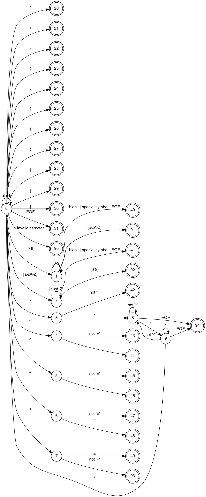

## INSTITUTO TECNOLÓGICO Y DE ESTUDIOS SUPERIORES DE MONTERREY

**Campus Santa Fe**

# Project 1

### Desarrollo de aplicaciones avanzadas de ciencias computacionales

**Group 501**

Student
Ricardo Alfredo Calvo Pérez - A01028889

Professor
Victor Manuel de la Cueva Hernández

_April 2026_

<h4>DFA</h4>

<h4>States Table</h4>

|     Meaning     | State | blank | letter | digit |  /  | \*  |  <  |  >  |  =  |  !  |  +  |  -  |  ;  |  ,  |  (  |  )  |  {  |  }  |  [  |  ]  | EOF | other |
| :-------------: | :---: | :---: | :----: | :---: | :-: | :-: | :-: | :-: | :-: | :-: | :-: | :-: | :-: | :-: | :-: | :-: | :-: | :-: | :-: | :-: | :-: | :---: |
|      START      |   0   |   0   |   2    |   1   |  3  | 20  |  4  |  5  |  6  |  7  | 21  | 22  | 23  | 24  | 25  | 26  | 27  | 28  | 29  | 30  | 31  |  90   |
|     IN_NUM      |   1   |  40   |   91   |   1   | 40  | 40  | 40  | 40  | 40  | 40  | 40  | 40  | 40  | 40  | 40  | 40  | 40  | 40  | 40  | 40  | 40  |  91   |
|      IN_ID      |   2   |  41   |   2    |  92   | 41  | 41  | 41  | 41  | 41  | 41  | 41  | 41  | 41  | 41  | 41  | 41  | 41  | 41  | 41  | 41  | 41  |  92   |
|    SAW_SLASH    |   3   |  42   |   42   |  42   | 42  |  8  | 42  | 42  | 42  | 42  | 42  | 42  | 42  | 42  | 42  | 42  | 42  | 42  | 42  | 42  | 42  |  90   |
|     SAW_LT      |   4   |  43   |   43   |  43   | 43  | 43  | 43  | 43  | 44  | 43  | 43  | 43  | 43  | 43  | 43  | 43  | 43  | 43  | 43  | 43  | 43  |  90   |
|     SAW_GT      |   5   |  45   |   45   |  45   | 45  | 45  | 45  | 45  | 46  | 45  | 45  | 45  | 45  | 45  | 45  | 45  | 45  | 45  | 45  | 45  | 45  |  90   |
|     SAW_EQ      |   6   |  47   |   47   |  47   | 47  | 47  | 47  | 47  | 48  | 47  | 47  | 47  | 47  | 47  | 47  | 47  | 47  | 47  | 47  | 47  | 47  |  90   |
|    SAW_BANG     |   7   |  93   |   93   |  93   | 93  | 93  | 93  | 93  | 49  | 93  | 93  | 93  | 93  | 93  | 93  | 93  | 93  | 93  | 93  | 93  | 93  |  90   |
|   IN_COMMENT    |   8   |   8   |   8    |   8   |  8  |  9  |  8  |  8  |  8  |  8  |  8  |  8  |  8  |  8  |  8  |  8  |  8  |  8  |  8  |  8  | 94  |   8   |
| SEE_END_COMMENT |   9   |   8   |   8    |   8   |  0  |  9  |  8  |  8  |  8  |  8  |  8  |  8  |  8  |  8  |  8  |  8  |  8  |  8  |  8  |  8  | 94  |   8   |

> [!NOTE]
> If the DFA or State table doesn't look properly please consider checking the original file in Markdown here: [Original File](https://github.com/RicardoCalvoP/TC3002B/blob/master/Compilers/Proyect1/solution.md)
