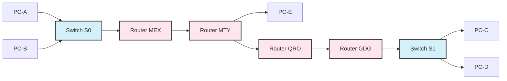

### Conexiones

### Router MEX

Conexión con $MEX \rightarrow S0$ full duplex
`interface gig 0/0 10.10.10.254 255.255.255.0`

Conexión con $MEX \rightarrow MTY$
`interface serial 0/0/0 172.16.17.6 255.255.255.252`

### Router MTY

Conexión con $MTY \rightarrow MEX$
`interface serial 0/0/0 172.16.17.5 255.255.255.252`

Conexión con $MTY \rightarrow QRO$
`interface serial 0/1/0 172.44.1.21 255.255.255.248`

Conexión con $MTY \rightarrow PC-E$
`interface gig 0/0 10.93.3.22 255.255.255.252`

### Router QRO

Conexión con $QRO \rightarrow MTY$
`interface serial 0/0/0 172.44.1.22 255.255.255.248`

Conexión con $QRO \rightarrow GDG$
`interface serial 0/1/0 172.16.3.9 255.255.255.252`

### Router GDG

Conexión con $GDG \rightarrow S1$ full duplex
`interface gig 0/0 192.168.1.254 255.255.255.0`

Conexión con $GDG \rightarrow QRO$
`interface serial 0/0/0 172.16.3.10 255.255.255.252`

### PC-A, PC-B, PC-C, PC-D
`IP Configuration: DHCP`

### PC-E

IPV4 Address
`10.93.3.21`
Subnet Mask
`255.255.255.252`
Default Gateway
`10.93.3.22`
